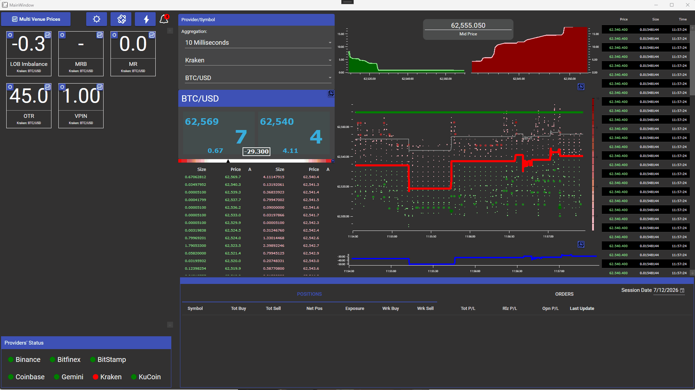

# VisualHFT

An open-source desktop application for real-time market microstructure analysis.

[](LICENSE.txt)
[](https://dotnet.microsoft.com/download/dotnet/10.0)

[](https://visualhft.com/discord)
[](https://github.com/visualHFT/VisualHFT/discussions)



[Quickstart](#quickstart) · [Write a plugin](#write-a-plugin) · [Architecture](docs/architecture.md) · [Changelog](CHANGELOG.md) · [Contributing](CONTRIBUTING.md)

## What it is

VisualHFT shows live order books and trades from supported venues in one desktop application. It gives traders, quants, and researchers a direct view of depth, liquidity, order flow, and market resilience while the market is moving.

## What you can see

| Order book | Studies | Extensions |
| --- | --- | --- |
| Follow depth, trades, spreads, and venue conditions in one view. | Watch VPIN, LOB Imbalance, Market Resilience, and Order-to-Trade Ratio as conditions change. | Add a market connector or study for the data and measures you need. |


## Quickstart

### Prerequisites

- Windows, the [.NET 10 SDK](https://dotnet.microsoft.com/download/dotnet/10.0), and Visual Studio.
- The VisualHFT OxyPlot fork. Place both repositories in the same parent folder.

```powershell
# Both repositories must sit in the same parent folder.
git clone https://github.com/visualHFT/oxyplot.git
git clone https://github.com/visualHFT/VisualHFT.git
```

Open `VisualHFT/VisualHFT.sln` in Visual Studio and build the solution. Set `VisualHFT` as the startup project and press <kbd>F5</kbd>. The Dashboard opens first. Select an available provider and a normalised symbol such as `BTC/USD` in the order-book panel.

Need help with setup? See [Troubleshooting](docs/troubleshooting.md) or ask in [Discord](https://visualhft.com/discord).

## Supported venues and studies

| Type | Included examples |
| --- | --- |
| Market data connectors | Binance, Bitfinex, Bitstamp, Coinbase, Gemini, Kraken, KuCoin, and a generic WebSocket connector |
| Built-in studies | VPIN, LOB Imbalance, Market Resilience, and Order-to-Trade Ratio |

## What it does

- Normalises live Level 2 order book and trade updates from supported connectors.
- Displays depth, trades, spreads, liquidity changes, and study outputs in one desktop view.
- Computes market microstructure metrics through included study plugins.
- Runs trigger conditions and sends alerts to the UI or REST endpoints.
- Supports additional connectors and studies without changes to the core application.

## Screenshots

<details>
<summary>Open the current dashboard views</summary>

| Depth | Limit order book |
| --- | --- |
|  |  |

</details>

## How it works

Connectors publish normalised market data to VisualHFT. The dashboard and study plugins read that data and update the live view. See the [architecture overview](docs/architecture.md) for the component map and data flow.

## Write a plugin

VisualHFT has two extension templates:

- [Market connector template](SDK-MarketConnectorTemplate/) for a new market-data source.
- [Study template](SDK-StudyTemplate/) for a custom market-microstructure calculation.

Use the matching template and guide. Plugin authors should also review `RequiredLicenseLevel` before distributing a plugin.

## Roadmap

See the [project roadmap](https://visualhft.com/#roadmap) for planned work. This README describes only functionality included in the public repository today.

## Changelog

See [CHANGELOG.md](CHANGELOG.md) for changes by date.

## Community and contributing

- **Questions and live discussion:** [VisualHFT Discord](https://visualhft.com/discord)
- **Ideas and project discussion:** [GitHub Discussions](https://github.com/visualHFT/VisualHFT/discussions)
- **Bugs and feature requests:** [GitHub Issues](https://github.com/visualHFT/VisualHFT/issues)
- **Research and updates:** [VisualHFT Connect](https://visualhft.com/connect)
- **Code and documentation contributions:** [CONTRIBUTING.md](CONTRIBUTING.md)

## License

VisualHFT is licensed under the [Apache License 2.0](LICENSE.txt).
