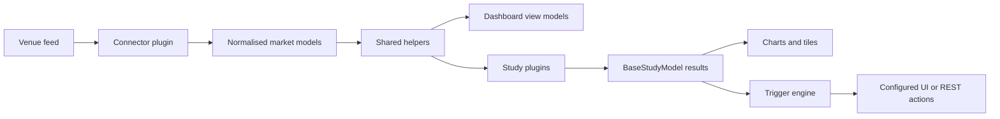

# Architecture overview

VisualHFT is a Windows desktop application that turns live venue data into a shared market-data view, analytical studies, and configurable trigger actions. This page describes the open-source repository as it runs today.

## System at a glance

## Components and dependency boundaries

### Desktop host

The `VisualHFT` project is the WPF application. It starts the application, loads and starts plugins, hosts the dashboard, and owns trigger configuration and the trigger engine.

### Shared libraries

`VisualHFT.Commons` contains the shared market models, helper publishers, plugin contracts, and plugin base classes. It does not depend on WPF.

`VisualHFT.Commons.WPF` contains reusable WPF support and depends on `VisualHFT.Commons`. The desktop host can use both libraries.

### Plugins

Connector and study assemblies use the shared contracts. A connector derives from `BasePluginDataRetriever`. A study derives from `BasePluginStudy`. Built-in plugins are included as project references by the host so their assemblies are copied beside the application for runtime discovery.

## Market-data path

A connector receives a venue-specific feed, maps it into VisualHFT's normalised models, and publishes updates through `RaiseOnDataReceived(...)`. Order books, trades, providers, and symbols are delivered by the corresponding shared helper.

Dashboard view models and study plugins subscribe to the same helpers. The helper callbacks are synchronous. A subscriber must finish quickly and must not retain the mutable `OrderBook` it receives.

## Study results and triggers

Studies decide how to process their input. A short calculation can run in a helper callback. A study that needs to keep an order-book state or do longer work can take an `OrderBookSnapshot`, queue that work, and dispose the snapshot when it is finished.

`BasePluginStudy.AddCalculation(...)` sends a `BaseStudyModel` through the study's aggregation and result path, then raises `OnCalculated`. The plugin manager registers single-study results with the trigger engine. The dashboard consumes the same study output for live tiles and charts.

This is deliberately not a claim that every study uses a queue or snapshot. For example, the VPIN study processes its configured trade and order-book callbacks directly, while the Market Resilience study snapshots order books before queued processing.

## Plugin discovery and lifecycle

At startup, `PluginManager.LoadPlugins()` scans the directory containing `VisualHFT.exe` for DLLs. It creates non-abstract exported types that implement `IPlugin`, then starts the applicable connector, study, or multi-study lifecycle.

For a source build, add an extension project as a `ProjectReference` to `VisualHFT.csproj`. Its output must be copied next to the application executable for the runtime loader to discover it. Discovery loads assemblies in the application process. It is not a process-isolation boundary.

## Extending VisualHFT

Start from the public templates:

- [Market connector template](../SDK-MarketConnectorTemplate/MarketConnectorSDK_Guidelines.md)
- [Study template](../SDK-StudyTemplate/StudySDK_Guidelines.md)
- [Extension guide](extending/README.md)

## Source map

- [Application startup](../App.xaml.cs)
- [Plugin discovery and lifecycle](../PluginManager/PluginManager.cs)
- [Connector publish contract](../VisualHFT.Commons/PluginManager/BasePluginDataRetriever.cs)
- [Study result contract](../VisualHFT.Commons/PluginManager/BasePluginStudy.cs)
- [Order-book callback helper](../VisualHFT.Commons/Helpers/HelperOrderBook.cs)
- [Disposable order-book snapshot](../VisualHFT.Commons/Model/OrderBookSnapshot.cs)

For a visual companion, see the [interactive architecture map](system-architecture.html).
